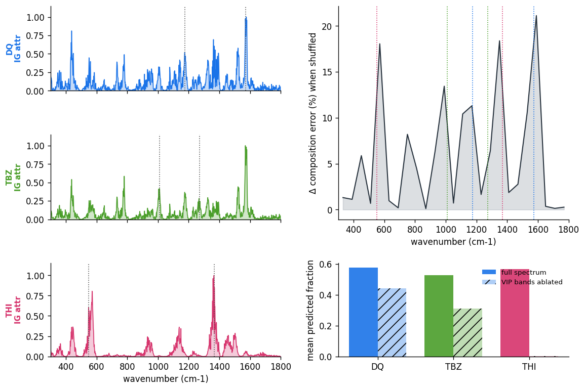

# DL interpretability — does the model use chemically meaningful bands?

A composition prediction is only trustworthy if it comes from the compounds' real SERS
marker bands, not from spurious correlations in the training set. We check this three
independent ways on the full-spectrum MLP (trained once on all 35 mixtures). All three
point at the **same bands**, which are the compounds' known VIP marker bands.

## (1) Integrated-Gradients attribution — *which wavenumbers drive each prediction*

Integrated Gradients (pure-torch, no SHAP dependency) attributes each compound's predicted
fraction back to the input wavenumbers, averaged over the mixtures where that compound is
present. Dotted lines mark the compound's VIP bands.

- **THI** — attribution is a sharp spike exactly at **1368 and 550 cm⁻¹** (its VIP bands):
  the model reads THI almost entirely off its marker bands.
- **DQ** — strong attribution near **1572 cm⁻¹** plus a distributed fingerprint.
- **TBZ** — attribution at **1010 / 1272 cm⁻¹** plus other fingerprint peaks.

So the model's evidence for each compound sits on that compound's real bands.

## (2) Band permutation importance — *which regions the accuracy depends on*

Each 60 cm⁻¹ window is shuffled across samples and the increase in composition error is
measured. The largest jumps (peaks in the curve) fall on **550, 1010, 1177, 1368 and
1572 cm⁻¹** — the union of the three compounds' VIP bands (coloured dotted lines). Shuffling
those regions costs up to ~20 % error; silent regions cost nothing.

## (3) Ligand ablation — *is the reliance causal?*

Zeroing a compound's own VIP bands and re-predicting:

| compound | VIP bands (cm⁻¹) | predicted fraction | change |
|---|---|---|---|
| DQ | 1572, 1176 | 0.54 → 0.43 | −22 % |
| TBZ | 1010, 1272 | 0.51 → 0.31 | −38 % |
| **THI** | 1368, 550 | 0.55 → **0.00** | **−100 %** |

Removing THI's bands collapses its prediction to zero — a fully causal dependence. DQ and
TBZ drop only partially because they carry richer fingerprints and the model uses more than
the two VIP bands for them (robust, not a single-feature shortcut).

## Conclusion

Attribution, permutation importance and ablation independently converge on the **same
chemically meaningful marker bands**. The MLP is not exploiting a dataset artefact — it
learned the compounds' real SERS signatures, which is what makes its composition predictions
credible.

*Reproduce:* `python experiments/dl/interpretability.py` (regenerates
`docs/dl_interpretability.png`).
