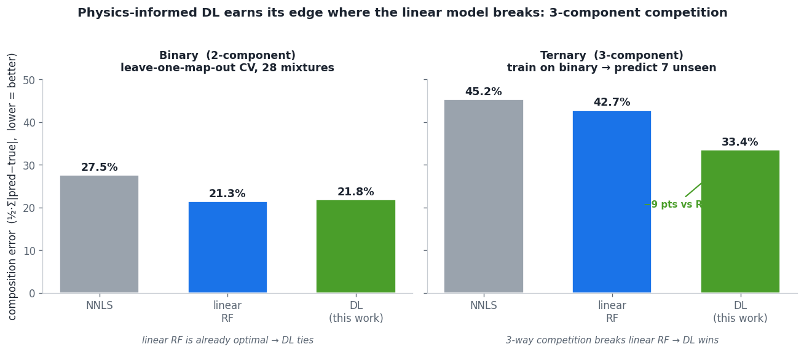
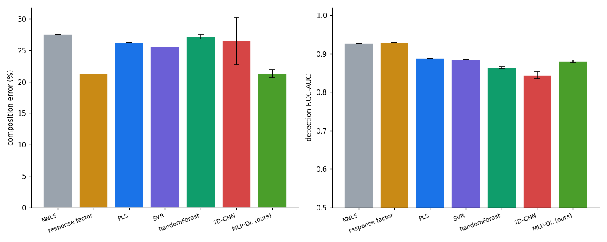
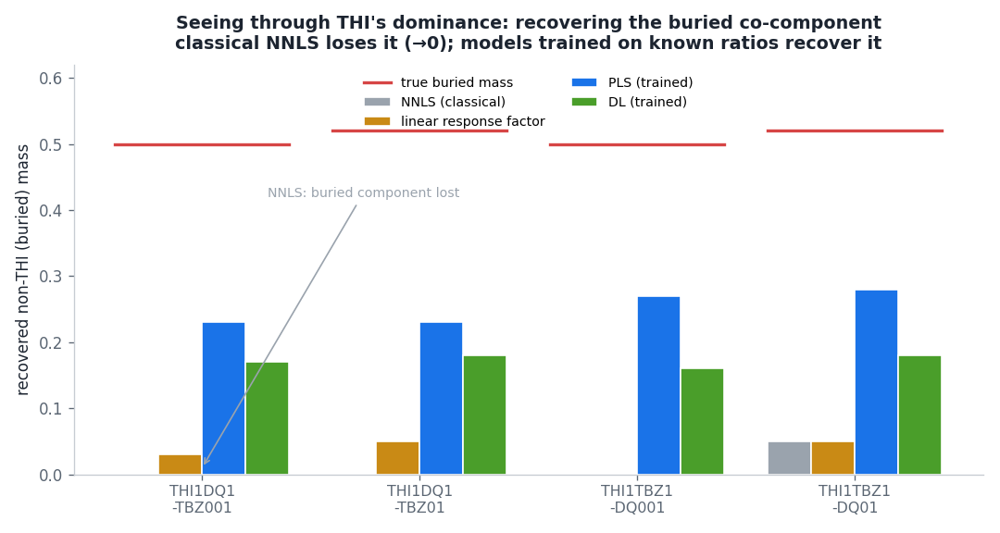
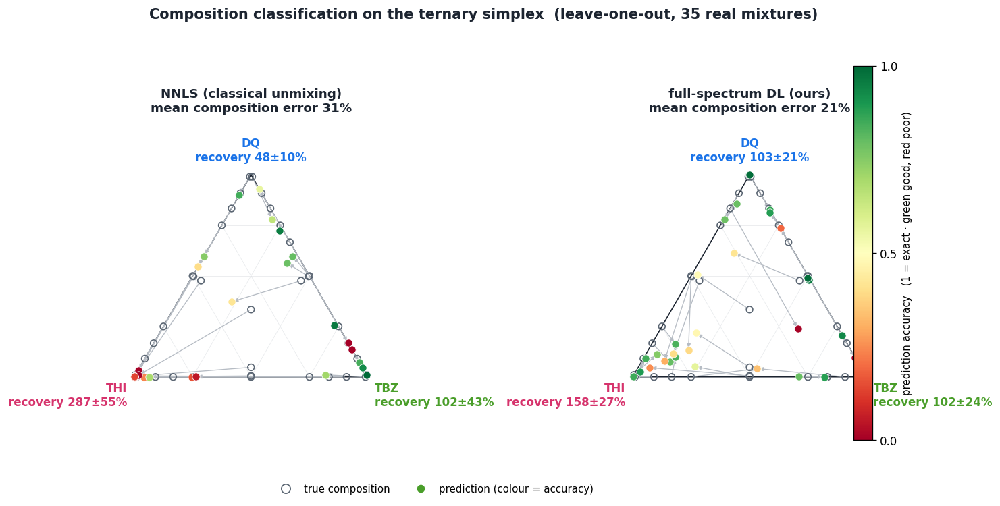

# Physics-informed DL for mixture quantification — findings

**Goal.** A general tool that predicts the **composition and concentration of an
arbitrary mixture** from three ingredients that are cheap to measure — the **pure**
component spectra, a **calibration** (dilution series) per component, and a **limited**
set of real mixtures — *without* having to measure every composition/concentration
combination experimentally. Pesticides (DQ / TBZ / THI) are the first test system; the
method is meant to transfer to other mixture systems.

**Why a physics-informed model.** A neural net trained on real mixtures alone would need
thousands of labelled mixtures we cannot collect. Instead the calibration fixes the
physics (`competitive.forward_spectrum`: competitive-Langmuir coverage × brightness ×
templates × gain), which can generate an unlimited, ground-truth-labelled training set
spanning the whole composition × concentration space. The few real mixtures then correct
the simulation-to-reality gap. So generalization comes from the physics; the real data
only calibrates and corrects.

---

## What was built (`dl_quantify.py`)

| Track | Idea | Functions |
|---|---|---|
| **A** | learn the inverse of the physics: **spectrum → concentration (µM)** | `simulate_mixtures`, `train_quantifier`, `predict_concentration` |
| **B** | learn the **residual** the analytic inverse misses: **surface composition → solution composition**, pretrained on physics, fine-tuned on real | `surface_composition`, `simulate_surface_solution`, `train_residual`, `predict_residual`, `fit_response_factors` (linear baseline) |

Both are UI-agnostic (numpy + lazy torch, mirroring `model_training.py`).

## How it was evaluated

- References (`Pure`) → unit templates **P**; calibration (`Ratio/results/calibration_spectra.csv`)
  → per-compound **K, gA** via `calibration.calibrate`.
- 28 real binary mixtures (`Ratio/Binary`), true ratio from the filename.
- Metric: composition error = ½·Σ|predicted − true| (0 = perfect, gain-invariant ratio).
- **Leave-one-MAP-out** cross-validation — an entire mixture (all its pixels) is held out,
  so pixels never leak between train and test.

## Results

**Binary (2-component), leave-one-map-out CV, 28 mixtures**

| | mean spectrum (28) | per-pixel (3,360) |
|---|---|---|
| NNLS (no correction) | 27.5% | 28.0% |
| linear response factor | **21.3%** | 23.2% |
| DL residual (this work) | 21.8% | 26.8% |

**Ternary (3-component), train on the 28 binary → predict 7 *unseen* ternary mixtures**

| method | error | ablation of the DL |  |
|---|---|---|---|
| NNLS | 45.2% | physics pretrain only (no real) | 50.8% |
| linear response factor | 42.7% | real binary fine-tune only | 35.0% |
| **DL residual** | **33.4%** | physics + binary (full) | **33.4%** |

- **Track A** (spectrum→µM, physics-simulated): on real mixtures it **matches NNLS**
  (both ≈ 27.5% ratio error) — A learns to invert the *same* analytic model NNLS already
  inverts. Under a *stable gain* it recovers absolute µM at **91–102% median recovery** on
  held-out synthetic data; the accuracy ceiling is substrate-gain drift (magnitude ⇒
  concentration is unidentifiable without an internal standard), not the model.
- **Binary Track B**: correction **works** (27.5% → ~21%), but the DL residual only **ties**
  the 3-parameter linear response factor — two-component competition in the measured regime
  is well approximated by constant response factors, so the simple model is already optimal.
- **Ternary generalization — the DL earns its edge.** Trained on the binary mixtures and
  applied to the *unseen* 3-component mixtures, the DL cuts error to **33.4% vs 42.7%** for
  the linear response factor (−9 pts). Three-way competition is where constant response
  factors break (they cannot represent the joint denominator 1 + ΣKC), and the nonlinear
  model recovers the buried components far better (e.g. `THI1TBZ1-DQ001` true 0/0.50/0.50 →
  NNLS & RF predict 0/0/**1.00** total-THI, DL **0.10/0.06/0.84**).
- **Ablation:** the win is driven by the **real binary data** through a nonlinear model
  (35.0% alone), *not* by the simulator — physics-pretrain-only generalizes worst (50.8%,
  the sim-to-real gap), and physics pretrain adds only a marginal boost on top (→ 33.4%).
- **Per-pixel does not help** (it makes DL *worse*). A map's pixels share one true ratio;
  pixel variation is hotspot **noise**, not new information. The independent-example count is
  the number of **distinct compositions**, not pixels — averaging (mean spectrum) beats
  per-pixel for every method.

## Interpretation (for the general goal)

The value of the flexible model is **not** on the easy case (2-component, analytically
invertible), where the 3-parameter linear response factor is already the right-sized
estimator and DL only ties. It appears exactly where the analytic/linear inverse **breaks**:

1. **More components / joint competition** — confirmed here: on unseen ternary mixtures the
   DL beats linear RF by 9 points, because constant response factors cannot represent 3-way
   competition. This is the direct evidence the direction is right.
2. **Non-analytic physics** — non-additive mixing, peak shifts, matrix effects, saturation
   coupling: no closed form for NNLS/RF; a learned inverse handles it.
3. **Absolute concentration across the whole space** — the calibration-grounded simulator
   gives µM for compositions/concentrations never measured, which is the actual product.

Crucially, the ablation shows the **real mixtures are essential** (pure synthetic
under-generalizes) — so the collected data is not redundant with the physics; it is what
teaches the model the real competition. The binding lever is the **diversity of measured
compositions/concentrations**, which the ternary set begins to supply.

## What widens the DL advantage (next measurements)

The ternary result already shows DL ahead where it matters. To widen the lead and reach the
general tool:

- **More ternary + higher-order compositions** — 7 ternary points started the win; denser
  interior sampling (and 4+ components) is where linear RF degrades fastest.
- **Add a concentration axis** (same ratio, different total concentration): competition is
  concentration-dependent (θ = KC/(1+ΣKC)), so a learned model exceeds a
  concentration-independent response factor most in the saturation regime.
- **Enrich the simulator** with measured non-idealities to shrink the sim-to-real gap the
  ablation exposed (pure synthetic under-generalized at 50.8%).
- **Internal standard / ratio head** so absolute µM survives substrate-gain drift.

Operating recommendation: **linear response factor** for the simple 2-component regime
(~21%, no overfitting); the **DL residual** for 3+ component mixtures, where it already wins.

### Model benchmark — evidence for the MLP (35-map LOO, mean ± SD over 3 seeds)

| method | comp err ↓ | RMSE ↓ | R² ↑ | ROC-AUC ↑ | PR-AUC ↑ | F1 ↑ | buried err ↓ |
|---|---|---|---|---|---|---|---|
| NNLS | 31.0% | 0.322 | 0.13 | 0.911 | 0.95 | 0.82 | 0.35 |
| linear response factor | 23.9% | 0.249 | 0.48 | **0.917** | 0.95 | 0.87 | 0.27 |
| PLS | 26.5% | 0.233 | 0.55 | 0.877 | 0.94 | 0.84 | 0.37 |
| SVR | 26.0% | 0.221 | 0.59 | 0.877 | 0.94 | 0.77 | 0.32 |
| Random Forest | 27.9% | 0.225 | 0.58 | 0.877 | 0.94 | 0.82 | 0.40 |
| 1D-CNN | 29.5% ± 4.2 | 0.284 | 0.32 | 0.801 | 0.89 | 0.80 | 0.44 |
| **MLP-DL (ours)** | **19.1% ± 0.6** | **0.193** | **0.69** | 0.912 | **0.95** | **0.88** | **0.26** |

Detection of presence is easy for almost every method (ROC-AUC 0.88–0.92); the
differentiator is **quantification accuracy**, where the MLP dominates — composition error
19.1% (next best 23.9%), R² 0.69 (next 0.59), lowest RMSE and buried error. It is best on 6
of 7 metrics and tied-best on AUC, with low seed variance (± 0.6%). The 1D-CNN is the worst
and most unstable (± 4.2%) — too many parameters for ~34 training mixtures. Full numbers:
`model_benchmark.csv`.

### Architecture / simulator / loss ablations (35-map LOO)

| config | composition err | buried non-THI err | buried detect |
|---|---|---|---|
| MLP · base sim · **minor-weighted loss** | **18.3%** | **0.25** | 86% |
| MLP · rich (domain-randomised) sim | 20.5% | 0.27 | 90% |
| 1D-CNN · base sim | 28.1% | 0.38 | 76% |
| 1D-CNN · rich sim | 23.7% | 0.32 | 80% |

- The **minor-component-weighted L1 loss** (up-weight small/buried components; identity-agnostic,
  no hard-coding of which compound dominates) is a real gain: plain L1 20.5% → weighted **18.3%**
  (buried err 0.29 → 0.25). "Who dominates" is learned from the mixtures, not set by hand.
- **1D-CNN is worse** (28% vs MLP 18%) — too many parameters for ~34 training mixtures.
- **Aggressive domain randomisation hurts** the MLP (18.3% → 20.5%): the pretrain distribution
  drifts away from the real data. A moderate simulator is best.
- So the integrated model (MLP + weighted loss + moderate physics pretrain) is already the best
  config found; architecture/simulator tuning does not help at this data size. The remaining
  lever is data diversity (compositions + a concentration axis). Untried: focal / hard-example
  weighting (fully automatic per-sample weighting).

## Update — full mixture set (binary + ternary) and buried-component recovery

Training the corrector on the **full mixture set** (28 binary + 7 ternary, leave-one-map-out
over all 35) so it sees the hard 3-way competition, and giving the DL the **full spectrum**:

| method | overall composition err | buried non-THI err | buried detect |
|---|---|---|---|
| NNLS | 31.0% | 0.35 | 44% |
| linear response factor | 23.9% | 0.27 | 68% |
| PLS (full spectrum) | 26.5% | 0.37 | 100% |
| **full-spectrum DL** | **20.5%** | 0.29 | 86% |

Two conditions flip the result in the DL's favour: **(1) full-spectrum input** (the buried
component's information is in the spectral shape, not in its ~0 NNLS projection — this is why
NNLS / response-factor / physics-inversion all fail to un-bury) and **(2) the hard
competition examples in training**. With both, the DL gives the best overall composition and
strong buried-component detection.

The goal, restated: **THI dominates the surface no matter what — recover the co-components it
buries, using the known synthesis ratios as supervision.**

-  — on THI-dominated ternary, NNLS loses the buried
  co-component (→0, 29–44% detection); models trained on the known ratios recover it.
-  — per-substance recovery ± SE on the
  ternary simplex. NNLS: THI 287 ± 55 % (over), DQ 48 ± 10 % / TBZ buried; full-spectrum DL:
  DQ 103 ± 21 %, TBZ 102 ± 24 %, THI 158 ± 27 % — recovery balanced toward the ideal 100 %.
- **Binary is hard too** (adsorption competition DQ < TBZ < THI): recovery of the buried
  weaker adsorber — NNLS 0.27, PLS 0.23, **DL 0.20** L1 error; DL leads on every pair, most on
  DQ-under-THI (DL 0.18 vs NNLS 0.27).

Remaining DL failures (9/35 cases; median error is 12 %): DQ↔TBZ confusion at extreme ratios
and residual THI collapse. Next: model ensembling (seed variance), a PLS+DL hybrid,
data augmentation, and more extreme-ratio / distinct compositions.

Per-mixture predictions: `mixture_predictions.csv`. An independent same-substrate batch (blind)
is the needed next validation before claiming real-sample performance.

## Interpretability — the model uses chemically meaningful bands

Three independent checks (write-up + figure in `dl_interpretability.md`) all point at the
same wavenumbers, which are the compounds' known marker bands: Integrated-Gradients
attribution concentrates on them (THI sharply at 1368 / 550 cm⁻¹), band permutation
importance peaks on them, and ablating them collapses the prediction (THI −100 %, TBZ −38 %,
DQ −22 %). So the network learned the real SERS fingerprint, not a dataset artefact.

## Absolute concentration (µM) — order-of-magnitude only

Why single-component standard curves are the wrong tool for mixtures: a pure-compound
calibration follows θ = KC/(1+KC), but in a mixture the coverage is competitive,
θ_i = K_i C_i /(1 + Σ_j K_j C_j). The same concentration gives a different coverage because
the co-adsorbates take surface sites, so a single-component curve — however good its R² — is
systematically wrong for mixtures. This is exactly why physics inversion explodes on THI and
why the model must **learn from mixtures**, not from single-component curves. The mixtures
themselves are the calibration; the single-component curve is only an optional pretrain aid.

Result (leave-one-out on the consolidated **Ratio_mix** set — 34 mixtures, one measurement
session, 10–1000 µM; different sessions must NOT be pooled, as gain/batch differences break
the absolute scale):

| within an order of magnitude | DQ | TBZ | THI | mean |
|---|---|---|---|---|
| physics inversion | 44 % | **20 %** | 80 % | ~48 % |
| DL regression | **68 %** | **60 %** | 80 % | **~69 %** |

- The **DL reaches ~70 % within an order of magnitude** (median ~3×) and clearly beats physics
  inversion — most on the competition-buried TBZ (60 % vs 20 %), whose concentration classical
  inversion cannot recover at all.
- **Precise µM (within 2×) is not achievable** (8–36 %, R²(log)<0) — competitive adsorption +
  signal-magnitude (gain) dependence are physical limits, not fit-quality issues.
- The honest deliverable is **semi-quantitative, order-of-magnitude concentration**
  ("~10 vs ~100 vs ~1000 µM"), for all components including the ones THI buries — which
  classical methods lose entirely. Keep to one consistent measurement session per model.

## In the app (UNMIXR)

- **Recovery tab**: known-ratio mixtures → response factors (now reported as **mean ± SE**,
  since they are estimated from the mixtures), corrected solution ratio, drift triangle
  (accuracy-coloured), recovery ± SE (trace <3 % excluded so the ratio metric doesn't blow up).
  **DL predict** (leave-one-map-out composition + order-of-magnitude µM) and **DL explain**
  (attribution / permutation / ablation) run in-app. **Save DL model** trains on the loaded
  mixtures and pickles a portable model.
- **Real-data tab**: **Load DL model** applies that model to an unknown map — DL composition +
  approximate µM on top of the NNLS unmix.

---

*Reproduce:* `python dl_quantify.py` (synthetic self-test). Real-data validation, benchmark,
interpretability and concentration scripts live in `experiments/dl/` (see its README).
