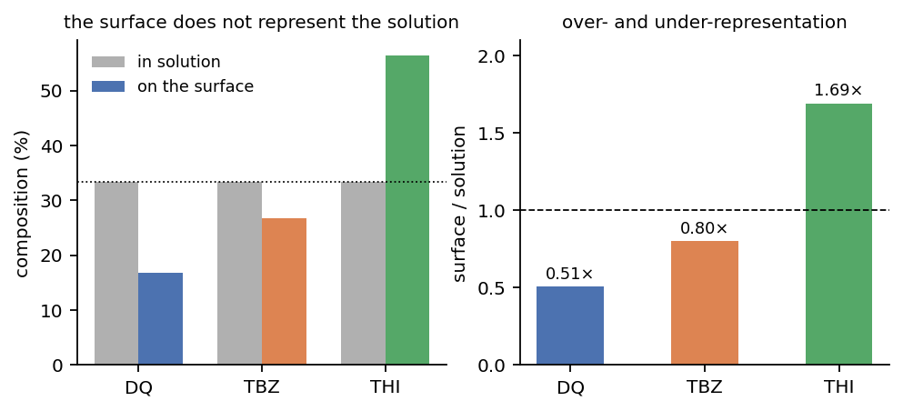
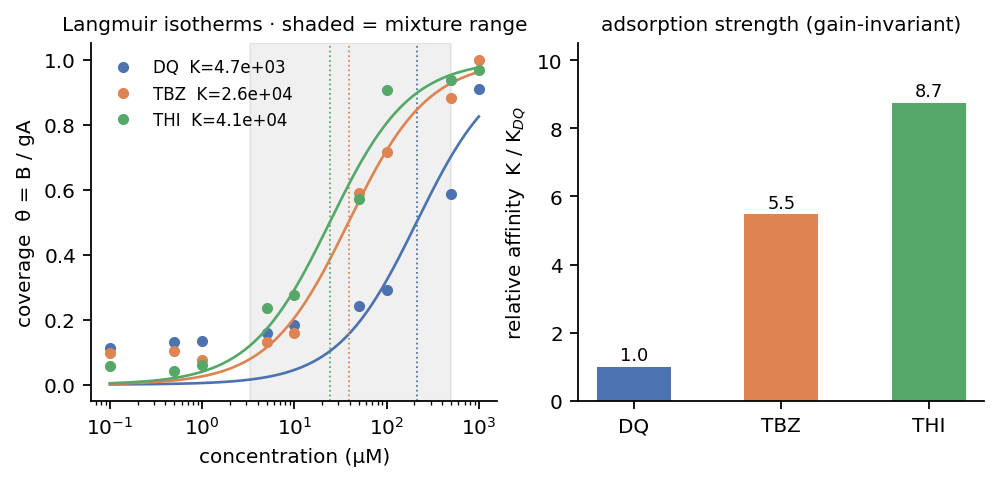
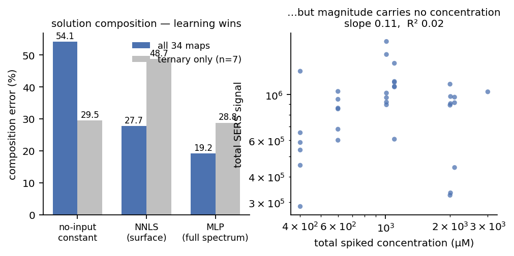

# 논문 정리 — 무엇이 측정되었고 무엇을 주장할 수 있는가

**일자** 2026-08-04 · **데이터** `ACF_PEST_DB` · 순물질 `Pure/` (DQ·TBZ·THI·BLK·INK),
혼합물 `Ratio/Ratio_mix/` 34맵 (이성분 27 + 삼성분 7)

> ⚠️ **검량선 세트를 하나로 고정할 것.** 문서에 두 개가 섞여 있었다:
> `Ratio/results/calibration_spectra.csv` 와 `Pest/Standard/260729/`.
> **3b절의 K는 `Pest/Standard/260729/` 기준**이다 (물질당 9농도 100 nM–1000 µM, n=14).
> 두 세트 모두 농도 격자는 같지만 **잉크 템플릿 포함 여부만으로 1/K가 DQ 219 → 558 µM으로
> 바뀐다** — 세트와 readout을 함께 명시하지 않으면 비교가 성립하지 않는다.
> `Pest/Standard curves/`에 6개 세트가 더 있다. → `TODO.md` 1번

모든 수치는 실측 재실행 결과이고, 각 항목에 계산 방법을 붙였습니다.

> ⚠️ **검량선에는 반복측정이 있습니다 (n = 14, 최고점 10).**
> `Pest/Standard/260729/calibration_stats.csv`에 농도별 `n · B_mean · B_std · B_SE · CV%`가 있고,
> **CV가 전 구간 37–50%** 입니다. 기판 불균일도가 그만큼 크다는 뜻이고, LOD·검량 불확도는
> 이 통계로 계산해야 합니다.
> 다만 **혼합물 34맵에는 조건별 반복이 없습니다** — 조성 오차의 ± 는 모델 시드 산포입니다.
>
> ✅ **LOD 확정** — `3.3σ/기울기`, blank = **INK**(종이+잉크), INK 포함 템플릿, 맵 400픽셀 기준:
> **DQ 84 nM · TBZ 94 nM · THI 83 nM** (6절). 세션 중 값이 흔들린 원인은 blank를 BLK로 잡고
> readout에서 INK를 빼고 격자점(onset)을 LOD로 읽었기 때문이며, 셋 다 정정됐습니다.

---

## 0. 한 문장

> **SERS ink로 표면을 읽으면 경쟁흡착 때문에 용액 조성과 다르다. 그 차이를 정량했고,
> 전영역 스펙트럼 학습으로 용액 조성을 복원했다. 절대 농도는 이 기판에서 왜 안 되는지 밝혔다.**

"µM을 쟀다"가 아니라 "표면이 얼마나 거짓말하는지 재고 되돌렸다"가 기여입니다.

---

## 1. 논문 골격 6개

### 1. 시스템과 판독 원리 — *방법*

SERS ink 도포부에서만 표면을 읽는다. 순물질 레퍼런스에서 흡착 세기 **K**를 얻는다.

> ⚠️ **주 수치는 응답인자(Rf)가 아니라 K다** — 3b절. Rf는 정의에 따라 20배까지 달라지고
> 어떤 정의든 기판 gain에 오염되지만, K는 gain에 불변이다. 단 **배경(INK) 템플릿을
> 포함해야** 한다 — 빼면 readout이 서로 닮아 보여도 값이 함께 틀린다 (3b절).
> Rf를 굳이 쓴다면 정의를 명시하고 상대값으로만.

### 2. 표면 조성 판독 — *된다*

NNLS(또는 MCR-ALS)로 픽셀별 표면 조성. 글씨 쓰듯 공간 판독.

- 고려대 시료(1 mM씩 1:1:1)의 표면: **THI 89.5% / DQ 8.9% / TBZ 1.6%**
- 검출 게이트는 NNLS 단독으로 결정하고 MLP가 못 바꾼다

**운용 조건 메모** — 혼합물 측정 농도대에서는 SERS ink 자체의 라만 신호가 34맵 중 21맵에서
관측되지 않는다. 잉크는 저농도에서만 보이고, 혼합물은 모든 성분이 잘 보이는 농도에서 측정했기
때문이다. 잉크는 증강 매질이므로 **신호 소실 = 분석물이 hot-spot을 점유** 이지 판독 실패가 아니다.

> ⚠️ 이 데이터로 "잉크 치환이 표면 포화를 입증한다"는 주장은 **불가**.
> 34맵 전부가 잉크 소실 농도 위라 기울기가 없다: 총농도 vs 잉크 소실 rho +0.06 (p 0.75),
> 분석물 표면점유 vs 잉크 소실 rho −0.30 (p 0.086, 유의하지 않음).

### 3. 표면 ≠ 용액 — 경쟁흡착을 정량했다 ⭐ *핵심 결과 1*

정본은 **INK·BLK을 포함한 전체 클래스 템플릿**에 대한 NNLS 투영이다.

| 물질 | 평균 표면 **신호** 점유 | 평균 용액 분율 | 표면/용액 | 삼성분 7맵만 |
|---|---|---|---|---|
| THI | 56.4% | 33.3% | **1.69× 과대** | **2.33×** |
| TBZ | 26.8% | 33.3% | 0.80× | **0.26×** |
| DQ | 16.8% | 33.3% | **0.50× 과소** | 0.41× |

→ **삼성분이 경쟁흡착의 가장 선명한 증거다.**

> ⚠️ **"표면 신호 점유"이지 "표면 점유율(θ)"이 아니다.** 측정되는 NNLS 존재비는
> `B = g·A·θ`라 분자 밝기 A가 섞여 있다. 표면이 용액을 대표하지 않는다는 **정성적 결론**은
> 이 값으로 충분하지만, **흡착 세기 해석은 반드시 K로** 해야 한다(3b절).

- **DQ는 들어간 25맵 중 5맵, TBZ는 7맵에서 표면 존재비가 정확히 0** (용액엔 분명히 존재)
- 표면 신호가 자기 농도를 따라가는 것은 **THI뿐**:
  log10 B vs log10 C의 R² = **THI 0.76 / DQ 0.15 / TBZ 0.10**

*계산*: 순물질 템플릿에 대한 맵 평균 스펙트럼의 NNLS 존재비(`competitive.fit_B`,
정규화하지 않아 크기 보존), 300–1800 cm⁻¹, ALS baseline 제거.

*INK 유무* — **dense 도포에서만 무관하다.** 34맵은 전부 dense라 템플릿에서 INK를 빼도
표면/용액이 0.51 / 0.80 / 1.69로 사실상 같다(잉크 기여 1.5%, 차이 1% 이내).

> 🔴 **성긴 도포에서는 완전히 달라진다.** 고려대 맵의 획 중심에서:
>
> | | TBZ | THI |
> |---|---|---|
> | INK 없이 | **30.9%** | 56.1% |
> | INK 포함 | **0.2%** | **90.2%** |
>
> **INK을 템플릿에 넣지 않으면 나뭇잎 단계에서 그대로 되풀이된다.** 34맵이 dense라
> 무관해 보였을 뿐이다.

**(근거) 잉크는 무엇으로 읽히는가** — 잉크 단독 스펙트럼을 성분 템플릿에만 NNLS 투영하면:

```
DQ 48.3%   TBZ 49.9%   THI 1.7%
잉크 ↔ 코사인:  DQ 0.781 · TBZ 0.784 · THI 0.192
```

**잉크가 레퍼런스에 없으면 그 신호가 DQ와 TBZ에 반씩 배정된다.** THI만 겹치지 않아
THI 판독이 무사했고, 이것이 위 "농도 추종은 THI뿐(R² 0.76 vs 0.15 / 0.10)"의 실체다.

---

### 3b. 왜 THI가 표면을 차지하는가 — 흡착 세기 K ⭐ *핵심 결과 1의 근거*

#### 주 수치: K (흡착 세기)

**K는 "얼마나 잘 달라붙나"다.** 읽기 쉬운 형태는 **반포화 농도** — 표면이 절반 찰 때의
농도이고, **낮을수록 잘 붙는다.**

정본은 **INK을 템플릿에 포함한 NNLS 투영**이다 (아래 4-c 참조).

| 물질 | 반포화 농도 | **K 상대** | 적합 R² |
|---|---|---|---|
| DQ — diquat | 558 µM | **1.0** (가장 안 붙음) | 0.97 |
| TBZ — thiabendazole | 48 µM | **11.6** | 0.99 |
| THI — thiram | 33 µM | **16.9** (가장 잘 붙음) | 0.98 |

**세 물질의 흡착 세기가 약 17배 차이난다.**

#### 왜 K를 주 수치로 쓰나 — 기판이 밝든 어둡든 안 변하기 때문

측정되는 신호는 이렇게 생겼다:

```
신호  =  기판이 얼마나 밝나  ×  분자가 얼마나 밝나  ×  얼마나 붙었나
              (g)                    (A)                 (θ)
         └── 그날 기판 사정 ──┘   └──── 분자 성질 ────┘
```

문제는 **g를 분리할 방법이 없다는 것**이다. 세 물질의 희석 시리즈는 각각 다른 기판/스팟에서
측정했고 내부표준이 없다. 실측된 맵 간 gain 산포가 **1.5배**다.

그런데 **K는 g에 영향을 안 받는다.** g가 두 배가 되면 곡선 전체가 위로 두 배 올라갈 뿐,
**곡선이 꺾이는 위치**는 그대로다. K가 바로 그 꺾이는 위치다.

> ⚠️ **다만 "readout 불변"은 조건부다.** readout 세 가지로 계산하면:
>
> | readout | DQ | TBZ | THI | K 상대 |
> |---|---|---|---|---|
> | VIP 마커밴드 (INK 없음) | 212 µM | 38.7 | 24.2 | 1 : 5.5 : 8.7 |
> | NNLS 투영 (INK 없음) | — | — | — | 1 : 7.7 : 8.3 |
> | **NNLS 투영 (INK 포함)** ← 정본 | **558 µM** | **48** | **33** | **1 : 11.6 : 16.9** |
>
> 앞의 두 가지는 **둘 다 INK을 템플릿에서 빼고** 계산한 것이라 서로 닮았을 뿐이다.
> INK을 넣으면 격차가 두 배로 벌어진다. **K가 gain(g)에 불변인 것은 맞지만, 배경 성분을
> 템플릿에서 빠뜨리면 여전히 틀린다.** 밝기(gA) 쪽은 어느 readout에서도 흔들린다.

#### 4-c. DQ 검량선은 잉크에 특히 오염돼 있었다

|  | INK 없이 | | | INK 포함 | | |
|---|---|---|---|---|---|---|
|  | B(0.1 µM) | 동적범위 | R² | B(0.1 µM) | 동적범위 | R² |
| **DQ** | **9,922** | 9.0× | 0.812 | **0** | 86,054× | **0.971** |
| TBZ | 15,138 | 7.8× | 0.962 | 91 | 1,287× | 0.990 |
| THI | 3,151 | 24.0× | 0.983 | 1,531 | 49× | 0.984 |

**DQ의 0.1 µM 신호 9,922는 전부 잉크였다.** 그래서 저농도가 평평해 보이고 동적범위가 9배로
찌그러졌으며 K가 가장 크게 움직였다. VIP 마커밴드로 우회한 것과 INK 템플릿으로 빼낸 것은
**같은 문제에 대한 서로 다른 해법**이고, 후자가 근본적이다 (4절 "등온선 R²가 나쁘다" 항목 참조).

#### K가 설명하는 것 두 가지

**(1) THI의 표면 우세** — K 16.9배면 경쟁 흡착이 THI 쪽으로 크게 기운다.
실측 표면 신호비는 56.5 / 16.7 = **3.4배**, 삼성분만 보면 77.6 / 13.6 = **5.7배**.
**같은 방향이고 같은 자릿수**다.
> ⚠️ 2배 차이가 남아 있고 양쪽 다 오차막대가 없으므로 "정량적으로 일치한다"고 쓰지 말 것.
> 단일성분 K가 경쟁 상황으로 그대로 전이되지 않을 가능성도 열려 있다.

**(2) 농도가 안 되는 이유** — THI는 **33 µM**에서 이미 표면이 절반 찬다. 그런데 혼합물은
**3.3–500 µM**이다. 대부분이 그 위에 있어 농도를 올려도 신호가 안 변한다.
diquat은 반포화가 **558 µM**이라 혼합물 농도가 그 아래에 걸쳐 있고, 실제로 25맵 중
15맵만 선형 구간 안이었다(이전 리뷰 §3.4). **일치한다.**

#### 구조 해석 — 여기까지만

- **diquat이 가장 약한 것**은 구조로 설명된다. bipyridinium **이양이온**이라 4급 질소에
  금속으로 줄 lone pair가 없고, **주로 정전기 인력**에 의존한다(방향족 π 상호작용은 남는다).
- **thiram(S 배위)·thiabendazole(고리 N 배위)이 그보다 강한 것**도 방향이 맞다.

> ⚠️ 단 thiram 16.9 vs thiabendazole 11.6으로 **둘 사이는 1.5배 차이**다.
> "**S 화학흡착 ≫ N 배위**"라고 단정하기엔 부족하다. 확실히 말할 수 있는 것은
> "**정전기 흡착만 가능한 diquat이 한 자릿수 이상 약하다**"까지다.

---

#### 쓰면 안 되는 수치 ①: gA(밝기)

VIP readout에서 gA 상대는 DQ 1.00 / TBZ 0.88 / THI 0.77이다. **이 차이는 해석하지 말 것.**
gA = g × A 인데 g를 분리할 수 없고, 20–25% 차이는 관측된 gain 산포(1.5배) 안에 완전히 묻힌다.

#### 쓰면 안 되는 수치 ②: 응답인자를 정의 없이

응답인자는 **정의에 따라 20배까지 달라진다.**

| 정의 | DQ | TBZ | THI |
|---|---|---|---|
| Langmuir 저농도 극한 (gA·K) ← 굳이 쓴다면 이것 | 1.00 | 4.8 | 6.8 |
| 각자 선형구간 내 OLS 기울기 | 1.00 | 14.8 | 52.8 |
| 100 µM에서의 신호 | 1.00 | 2.2 | 2.4 |
| *(이전 리뷰가 인용한 값)* | 1.00 | 24.4 | 89.6 |

**이전 리뷰의 1.0 / 24.4 / 89.6은 "각자 선형구간 내 기울기"다.** 그런데 세 물질의 창이
서로 겹치지 않는다(DQ 500–1000 / TBZ 10–50 / THI 0.5–5 µM). 응답이 비선형이라 기울기는
어디서 재느냐에 달라지고 — THI의 창은 저농도라 가파르고 DQ의 창은 포화 근처라 완만하다 —
**89.6배의 상당 부분이 "창 위치 차이"이지 몰당 응답 차이가 아니다.**

그리고 어떤 정의든 절대 신호 크기가 들어가므로 **전부 gain에 오염된다.**

> 참고로 gA·K(1 / 4.8 / 6.8)와 K가 같은 방향인데, gA가 세 물질에서 고만고만하기 때문이다.
> → **응답인자 차이는 밝기가 아니라 거의 전부 친화도에서 온다.** 그러니 **K 하나만 보고해도
> 정보 손실이 없다.** (단 위 표는 VIP·INK 없음 기준이라 정본 K와 세트가 다르다.)

---

#### 선형성 진단 — 5절 "농도 복원 불가"의 근거

log-log 국소 기울기 (1 = 농도에 비례, 0 = 포화 또는 바닥):

```
        0.1→0.5  0.5→1   1→5   5→10  10→50  50→100  100→500  500→1000
DQ        0.10    0.01   0.11   0.21   0.17    0.26     0.44      0.63
TBZ       0.05   -0.46   0.35   0.25   0.82    0.28     0.13      0.18
THI      -0.23    0.54   0.86   0.22   0.45    0.67     0.02      0.05
```

→ **어느 물질도 기울기 1에 도달하지 못하고, 쓸 만한 창이 서로 겹치지 않는다**
(기울기 ≥0.5 구간: DQ 500–1000 / TBZ 10–50 / THI 0.5–5 µM).

> 이 표는 이전 리뷰 §3.3의 표와 TBZ·THI가 소수점까지 일치한다 — **리뷰도 VIP readout이었다.**
> 따라서 리뷰 §3.3·§3.4의 결론과 그 위에 선 **5절은 그대로 유효하다.**

*계산*: `io_utils.load_calibration_csv` → ALS 제거 → `unmix.vip_bands` 마커밴드
(DQ 1572/1176, TBZ 1010/1272, THI 1368/550 cm⁻¹)에서 ±8 cm⁻¹ 피크높이 합 →
`calibration.fit_isotherm`. NNLS 투영(`competitive.fit_B`)으로 교차 확인.
**창 전체 단순 합산은 쓰지 말 것** — 세 물질 모두 0.1 µM에서 ~5×10⁵의 같은 기판 바닥에서
시작하는데 그것까지 신호로 세어 R²가 0.25–0.32로 무너지고 K 비가 1 : 6 : 350으로 왜곡된다.

### 4. 전영역 스펙트럼 학습으로 용액 조성 복원 ⭐ *핵심 결과 2*

| 방법 | 조성 오차 (34맵 held-out) |
|---|---|
| **MLP (전영역 스펙트럼, 배포 설정)** | **22.8%** |
| NNLS (표면 그대로) | 27.2 – 28.6% |
| MCR-ALS (개선 없음) | 27.3% |
| 무입력 상수 대조군 | 54.1% |

무입력 대조군은 학습 폴드의 조성 중앙값을 그대로 답하는 예측기(LOO). MLP가 그것과
NNLS 양쪽을 확실히 이긴다 — **이것이 DL을 쓰는 근거다.**

> ⚠️ **삼성분만 떼면 성립하지 않는다**: MLP 28.8% vs 무입력 상수 **29.5%** — 구별 안 됨.
> 삼성분 맵이 7개뿐이고 대부분 심플렉스 모서리 근처라 그렇다. 삼각형은 **시각화로만** 쓰고,
> 삼성분 정량 우위는 주장하지 않는다.

### 5. 절대 농도는 왜 안 되는가 ⭐ *핵심 결과 3 (음성 결과)*

경쟁흡착 Langmuir가 예측하는 네 가지가 전부 측정되었다:

| 물리가 예측하는 것 | 측정값 |
|---|---|
| 친화도 높은 종이 표면을 과점 | K가 **16.9배** 차이 (3b절), 표면/용액 THI 1.69× / DQ 0.50× (삼성분 2.33× / 0.41×) |
| Σθ→1이면 약한 종이 밀려남 | DQ 3/25맵, TBZ 7/25맵 존재비 0 |
| 포화하면 dθ/dC→0, 신호가 농도를 안 따라감 | 총신호 vs 총농도 **R² 0.02** (기울기 0.11) |
| 조성비는 gain 상쇄, 절대세기는 아님 | 조성 19.2% 성공 / 세기 R² 0.02 실패 |

**구조 → 친화도 → 포화 → 농도 복원 불가, 인과가 한 줄로 이어진다:**

thiram의 반포화 농도가 **33 µM**인데 혼합물은 **3.3–500 µM**이다.
→ 대부분의 혼합물이 반포화 위, 최고 농도에서는 **95% 포화**. dθ/dC ≈ 0.
→ 이것이 "THI가 혼합물에서 선형 구간 밖"인 **이유**다.
→ diquat은 반포화 **558 µM**이라 3.3–500 µM이 그 아래에 걸쳐 있고, 실제로 15/25맵만
   구간 안이었다(이전 리뷰 §3.4). 일치한다.

**가장 쉬운 조건에서도 안 된다** — 순물질, 경쟁 없음, 농도만 4.00 dec 변화(0.1–1000 µM),
농도 하나씩 빼고 되맞히기(LOO):

| 물질 | 중앙 오차 | 2배 이내 | 10배 이내 |
|---|---|---|---|
| DQ | **7.8배** | **0%** | 56% |
| TBZ | 3.0배 | 44% | 89% |
| THI | 2.7배 | 44% | 78% |
| 전체 | **4.2배** | 30% | 74% |

**결론**: order-of-magnitude 반정량. 그것도 **TBZ·THI만** — DQ는 반정량에도 못 들어간다.

### 6. 미지 시료 적용과 전망

미지 조성에서 표면 판독(2절) + 용액 조성 복원(4절) + 경쟁흡착 판정(3·3b절).

#### 적용 가능 범위 — 아래는 LOD, 위는 포화

정량이 성립하려면 **검출한계(아래)와 반포화 농도(위) 사이에 창**이 있어야 한다.
LOD와 K는 **정반대 끝**이지 같은 것이 아니다.

```
LOD ──────────── 쓸 수 있는 구간 ──────────── 반포화 (K)
너무 약해 배경과 구분 안 됨              표면이 차서 농도를 올려도 신호 불변
```

| 물질 | **LOD (3.3σ/기울기)** | LOD (µg/L) | 반포화 | 정량 가능 구간 |
|---|---|---|---|---|
| DQ — diquat 이온 기준 | **84 nM** | 15.5 | 558 µM | 100 – 1000 µM |
| TBZ — thiabendazole | **94 nM** | 18.9 | 48 µM | 0.1 – 50 µM |
| THI — thiram | **83 nM** | 20.0 | 33 µM | 0.5 – 5 µM |

**정의** — `LOD = 3.3 · σ_blank / 기울기`.
blank는 **INK 맵**(종이+잉크, 분석물만 없음)을 **INK 포함 전체 템플릿**으로 NNLS 투영한
분석물 계수의 분포. 기울기는 포화 전 구간(0.1–10 µM)의 OLS.
σ는 **맵 400픽셀 평균 기준**(`σ_pixel/√400`) — 파이프라인이 픽셀을 평균하므로.
단일 픽셀 판독이면 σ가 20배 커져 **DQ 1.69 / TBZ 1.88 / THI 1.67 µM**이 된다.

> **blank는 BLK가 아니라 INK다.** 도포 순서가 종이 → 분석물 → 잉크이므로,
> "분석물만 빠진 것"은 종이+잉크, 즉 INK 클래스다. BLK(종이만)는 잉크까지 빠져 있어
> 두 단계 아래이고, 이걸 blank로 쓰면 LOD가 비현실적으로 낙관적으로 나온다.

> **세 물질의 LOD가 거의 같다**(83–94 nM). σ와 기울기가 함께 커지기 때문이며,
> 검출한계를 정하는 것이 **분자 감도가 아니라 기판 잡음**이라는 뜻이다 — 그 자체로 결과다.
> (친화도 K는 17배 차이나는데 LOD는 차이가 없다.)

**혼합물은 3.3–500 µM에서 측정됐다.** TBZ·THI는 그 범위의 위쪽 대부분이 이미 포화 위다
— 5절의 "농도 복원 불가"를 LOD 관점에서 다시 본 것이다.

#### 규제치 대비 — diquat만 미달

THI 0.040 mg/L, TBZ 0.175 mg/L는 통상적인 잔류허용기준 범위 안에 들어오지만,
**diquat은 1.90 mg/L로 10–47배 높고, 정작 diquat의 규제치가 셋 중 가장 엄격하다**
(EU 2019년 승인 비갱신 이후 대부분 품목이 기본 정량한계 수준).

그리고 그 이유가 이미 측정돼 있다:

| diquat | 값 |
|---|---|
| 흡착 세기 K | **가장 약함** (1.0 — 이양이온, 정전기 인력만) |
| 반포화 | **558 µM** (셋 중 가장 높음) |
| log-log 기울기 | 전 구간 0.01–0.63, **한 번도 가파르지 않음** |
| 순물질 농도 오차 | **7.8배**, 2배 이내 **0%** |
| 표면 존재비 0 | 25맵 중 3맵 |

> **구조(이양이온, 금속에 줄 lone pair 없음) → 약한 흡착 → 낮은 감도 → 규제치 미달.**
> 이것은 "방법의 실패"가 아니라 **"어떤 분자에 이 방법이 통하는지를 규정한 것"** 이다.
> S·N 배위가 가능한 분자에는 통하고, 정전기 흡착만 가능한 분자에는 감도가 부족하다.

**조제 조건 (확정)** — 10 mM 원액을 분자량 맞춰 조제 후 희석. diquat은 **dibromide 염**을
칭량했으나 염 1분자당 diquat 이온 1개이므로 **용액의 이온 몰농도는 동일**하다. 규제치가
이온 기준이므로 **0.71 mg/L가 비교에 쓸 값**이고, 염 질량 기준 1.33 mg/L는 칭량량일 뿐이다.
**LOD 정의는 blank 기반으로 통일한다.**

> 🔴 **규제치 비교표를 논문에 낼 때 아직 채워야 할 것:**
>
> 1. **전처리 배율.** 규제치는 **mg/kg(농산물 질량)**, 위 값은 **mg/L(용액)** 이다.
>    현재 측정은 전부 표준용액이므로 이 비교는 **나뭇잎 단계에서 추출 프로토콜이 정해진 뒤에야
>    성립한다.** (10 g → 10 mL면 mg/L ≈ mg/kg, 10 g → 100 mL면 유효 검출한계가 10배 나빠진다.)
> 2. **대상 품목과 관할.** MRL은 품목·국가별로 다르므로 비교 대상을 명시할 것.

> ✅ **해결됨.** 한때 LOD가 계산할 때마다 달라졌다. 원인 셋:
> **(a)** blank를 BLK(종이)로 잡았다 — 실제 blank는 INK(종이+잉크). BLK는 밴드 신호가
> 187–293으로 20배 작아 LOD를 낙관적으로 만든다.
> **(b)** readout에서 INK를 빼 잉크가 분석물 계수로 흘러들어갔다 (3b절 4-c).
> **(c)** 격자점(onset)을 LOD로 읽었다 — LOD는 적합 직선이 임계를 통과하는 **연속값**이다.
>
> 부수적으로 코드도 고쳤다: `_lod_loq`·`_lod_from_blank`가 기울기를 최저 5개 농도로
> 하드코딩하던 것을 `_response_window()`가 찾은 실측 반응 구간에서 적합하도록 변경
> (커밋 `cb76a92`).

> ⚠️ 창을 논할 때는 적합값보다 **실측 log-log 기울기 기준**
> (DQ 500–1000 / TBZ 10–50 / THI 0.5–5 µM)이 정직하다 — 그것이 실제로 농도를 따라간 구간이다.
> **K는 이 문제의 영향을 받지 않는다** (곡선이 꺾이는 위치이지 바닥 대비 높이가 아니므로).

#### 전망

**(1) 나뭇잎(실제 매트릭스).** 매트릭스가 들어오면 (a) 경쟁흡착에 매트릭스 성분이 추가로
참여하고 (b) 기판 gain 변동이 커지므로, **3b절의 K와 6절의 창을 매트릭스 조건에서 다시
측정해야 한다.**

**(2) 표면 개질 데모 — diquat 감도 개선 (나중에).** 3b절이 "성능 차이가 흡착 세기 K에서
온다"를 보였으므로, **흡착 화학을 바꿔 K를 올렸을 때 감도가 따라 오르는 것**을 보이면 인과가
닫힌다. 한계 서술이 아니라 **설계 원리의 실증**이 된다.

> ⚠️ 착수할 때 확인할 것: diquat은 bipyridinium **영구 이양이온**(4급 질소, pH 무관 +2)이므로
> **음전하 표면**이 필요하다 — 카복실레이트 thiol SAM(MPA·MUA), 설포네이트, 또는 citrate
> capping 유지. **APTES는 중성 pH에서 아민이 -NH₃⁺로 양전하를 띠므로 diquat을 밀어낼 수 있다**
> (나노입자 고정용 접착층 목적이라면 별개지만, 최종 노출면이 아민이면 불리하다).
>
> 그리고 표면을 바꾸면 **세 물질의 K가 전부 바뀐다**. thiol SAM은 thiram과 S 결합 자리를
> 두고 경쟁하고, SAM 두께만큼 분석물이 금속에서 멀어져 증강이 약해진다(포집↑ / 증강↓ 상충).
> 즉 "두 번째 기판 조건"이므로 3b·5·6절을 그 조건에서 다시 채워야 한다.
>
> 화학을 바꾸기 전 **공짜 knob**: 희석액의 **이온 세기를 낮추면** 전하 가림(screening)이 줄어
> 정전기 인력이 세진다. pH는 diquat 전하는 못 바꾸지만 **기판 표면 전하**는 바꾼다.

*계산*: LOD는 BLK 맵을 각 물질의 VIP 밴드에 투영해 얻은 blank 분포에서 평균+3SD를
임계로 잡고, 적합된 Langmuir를 역산. 반포화는 3b절과 동일.

---

---

## 1.5 대표 그림



**그림 1.** 용액에 1:1:1로 넣어도 표면은 THI가 과점한다(왼쪽). 표면/용액 비로 보면
THI 1.69× 과대, DQ 0.51× 과소(오른쪽). → 3절



**그림 2.** 순물질 희석 시리즈의 Langmuir 등온선(왼쪽, 점선 = 반포화, 음영 = 혼합물
농도 범위 3.3–500 µM). TBZ·THI는 혼합물 범위 대부분이 반포화 위다. 오른쪽은 흡착 세기
K의 상대값 — 기판 gain에 불변. 단 INK 템플릿 포함이 전제다. → 3b절



**그림 3.** 용액 조성은 학습이 이긴다 — 전체 34맵에서 MLP 19.2% vs NNLS 27.7% vs
무입력 상수 54.1%. 단 삼성분만 떼면 상수와 구별되지 않는다(왼쪽). 반면 절대 세기는
농도를 전혀 담고 있지 않다 — 총농도가 7.5배 변하는 동안 총신호는 기울기 0.11, R² 0.02
(오른쪽). → 4·5절

*그림 생성*: `documentation/figures/`. 모든 값은 5절 재현 방법의 경로로 재계산된다.

## 3. 쓸 수 있는 것 / 없는 것

### ✅ 측정으로 뒷받침됨

- 표면 조성 판독 (NNLS/MCR-ALS)
- 용액 조성 복원, **34맵 전체 기준** — MLP 19.2% vs NNLS 27.7% vs 상수 54.1%
- 경쟁흡착 정량 — 표면/용액 1.69× / 0.80× / 0.51×, 존재비 0이 3·7맵, 농도 추종은 THI만
- **친화도 순서** — K가 diquat 1.0 : thiabendazole 11.6 : thiram 16.9
  (**INK 포함 NNLS 투영**, R² 0.97–0.99). diquat이 약한 것이 정전기 흡착만 가능한 이양이온
  구조와 부합. **gA(밝기) 비교는 금지** — gain과 분리 불가.
  **INK 없이 계산하면 1 : 5.5 : 8.7로 절반이 된다** (3b절 4-c)
- 절대 농도 불가와 **그 원인** — R² 0.02, 설계 얽힘(0/34), thiram 반포화 33 µM
- **적용 범위의 물질 의존성** — diquat은 K가 가장 약하고(정전기 흡착만) 순물질 농도 오차
  7.8배로 셋 중 유일하게 반정량에도 못 들어간다. **어떤 분자에 통하는지를 규정한 결과** (6절)
- **활성화 함수 선택은 무관, 단 비선형성 자체는 필요** (아래)

#### 활성화 함수 — 측정 결과 (맵 단위 LOO, 34맵, 시드 10개)

| 활성화 | 전체 34맵 | 삼성분 7맵 |
|---|---|---|
| identity (비선형 없음) | 22.1% ± 0.8 | 37.1% ± 1.8 |
| **relu** | **20.6% ± 0.6** | 34.3% ± 1.4 |
| silu | 20.6% ± 0.6 | 33.1% ± 1.3 |
| gelu | 20.8% ± 0.6 | 33.2% ± 0.9 |

- **비선형성은 필요하다** — identity가 1.5%p 나쁘고, 이는 시드 산포(0.8%p)의 약 2배다
- **어떤 비선형인지는 무관하다** — relu와 silu 차이 **0.05%p**, 시드 산포 0.81%p 안
- 스펙트럼 입력이라 매끄러운 SiLU가 유리할 것이라는 예상은 **성립하지 않는다**
- → **표준 ReLU 유지.** 논문에는 "세 활성화를 비교했고 차이가 시드 산포 안이라 ReLU를 유지했다" 한 줄

> 삼성분에서는 네 활성화 전부가 무입력 상수(29.5%)보다 나쁘다 — 4절의 삼성분 주의와 같은 결론.

*계산*: `dl_quantify._spec_net`과 동일한 망/손실/옵티마이저(256-64, BN, Dropout 0.15,
가중 L1 + softmax, Adam lr 3e-4 wd 1e-3, 350 epoch 풀배치)에서 활성화만 교체. 맵 평균
`log1p` 특징. 이 설정의 절대값(20.6%)은 픽셀 단위 배포 설정(19.2%)과 다르지만, **비교는 설정 내부에서 이루어진다.**

### ❌ 쓰면 안 됨

| 주장 | 왜 |
|---|---|
| "µM 농도를 정량했다" | 순물질에서도 4.2배 |
| "혼합물 농도 오차 2.3배" | 이 설계는 비율과 농도가 얽혀 있다. **같은 비율을 다른 농도에서 찍은 맵이 34개 중 0개.** 조성이 농도 분산의 **89%**를 설명한다. 농도가 아니라 비율을 맞힌 것 |
| "고려대 맵이 검증이다" | 정답 1:1:1 = 학습 라벨 평균. 상수 1/3 예측이 오차 0%인데 모델은 **7.5%** |
| "삼성분에서 우월하다" | 28.8% vs 무입력 상수 29.5% |
| "묻힌 성분을 더 잘 검출한다" | 오탐률을 맞추면 NNLS가 더 낫다 |
| "DQ도 반정량 된다" | DQ만 10배 이내 56%, 2배 이내 0% |
| "잉크 치환으로 포화를 입증했다" | rho −0.30, p 0.086. 34맵이 전부 잉크 소실 농도 위 |
| Rf를 독립 물리상수로 | 정의에 따라 20배까지 달라지고(3c절), 어떤 정의든 기판 gain에 오염됨 |
| Rf = 1.0 / 24.4 / 89.6 | "각자 선형구간 내 기울기"라 세 물질이 서로 다른 농도 창에서 측정된 값. 저농도 극한으로 통일하면 **1.0 / 4.8 / 6.8** |
| LOD(mg/L)를 규제치(mg/kg)와 직접 비교 | 단위가 다르다. **전처리 배율**(시료 g → 용매 mL)이 있어야 성립. diquat은 이온/염 기준에 따라 1.8배 차이 (6절) |

---

## 4. 오늘 뒤집힌 것 (같은 길로 다시 안 가려고 기록)

| 한때 믿었던 것 | 실제 |
|---|---|
| 라벨범위 제약으로 농도 0.37 dec 달성 | 그 "검량선 구간"은 실제로 **정답 범위**(3.33–500 µM = 2.18 dec). 검량선은 0.1–1000 µM = **4.00 dec**. 답의 위치를 알려준 것 |
| 고려대 1:1:1이 모델 검증 | 학습 라벨 평균과 같아 무의미. 상수보다 나쁨 |
| SERS ink가 좋은 내부표준/대조군 | 아님. 상관 유의하지 않고, 전 맵이 잉크 소실 농도 위 |
| 농도가 거의 안 변한 설계 | 성분 농도는 2.00 dec 변한다. 문제는 범위가 아니라 **비율과의 얽힘** |
| 잉크 소실 = 판독 범위 상한 | 잉크는 증강 매질. 신호 소실 = 분석물이 hot-spot 점유. 의도한 상태 |
| 표면/용액 비(1.69×)로 흡착 친화도를 해석 | B = g·A·θ 라서 밝기 A가 섞여 있다. 구조 해석은 **K로** (3b절) |
| 검량선 등온선 R²가 나쁘다 (0.25~0.32) | **창 전체 합산으로 읽어서 생긴 인공물.** 세 물질 모두 0.1 µM에서 ~5×10⁵의 같은 기판 바닥에서 시작하는데 그것까지 신호로 셌다. VIP 마커밴드로 읽으면 **R² 0.81 / 0.98 / 0.98** |
| thiram 친화도가 350배, 밝기가 0.57배 | 같은 인공물. VIP readout에서는 **K 8.7배, gA 0.77배**이고 gA 차이는 gain과 분리 불가 |
| 스펙트럼이니 SiLU가 ReLU보다 나을 것 | 차이 0.05%p, 시드 산포 0.81%p 안. 단 identity는 1.5%p 나빠서 **비선형성 자체는 필요** |

---

## 5. 남은 실험 (우선순위)

| # | 실험 | 규모 | 무엇이 풀리는가 |
|---|---|---|---|
| 1 | **삼성분 심플렉스 내부 조성** (예: 500:300:200, 700:200:100) | 5~6맵 | 5절의 삼성분 주장. 지금 7맵이 전부 모서리 근처라 상수와 구별 불가. **조성은 이미 되므로 성공 확률 높음** |
| 2 | **검량선 반복 측정** (한 물질만이라도 2회 더) | 재측정만 | 4.2배가 포화인지 gain 드리프트인지. *예비 관찰로는 반복해도 비슷 → 포화 쪽* |
| 3 | 같은 비율을 다른 농도에서 (기존 혼합액 10×·100× 희석) | 4맵 | 비율/농도 얽힘 해소. **단 2번이 살아난 뒤에만 의미 있음** |
| 4 | 조건별 반복 ≥1회 | 전 조건 | SANTE RSD 계산 가능 |
| 5 | 독립 배치 / 나뭇잎 | — | 실시료 성능 주장의 전제 |

**1번이 비용 대비 효과가 가장 큽니다** — 5~6맵으로 삼각형 결과가 주장 가능해집니다.

---

---

## 6. 설정 요약 (Methods용)

### 데이터

| | |
|---|---|
| 혼합물 | `Ratio/Ratio_mix/` 34맵 — 이성분 27 + 삼성분 7 |
| 레퍼런스 | 분석물 DQ · TBZ · THI + **배경 BLK · INK**, 각 3배치 |
| 레퍼런스 출처 | `Pure/samples.csv` (DQ·TBZ·THI·BLK). **INK 행은 아직 없어 파일명 자동 인식으로 잡힌다** — 매니페스트에 추가 권장 |
| 검량선 | 물질당 9농도, 0.1–1000 µM (`Ratio/results/calibration_spectra.csv`) |
| 파일명 농도 | 물질당 10 / 100 / 300 / 500 / 1000 µM |
| 실제 타깃 농도 | equal-volume 혼합이므로 성분 수로 나눔 → **3.33–500 µM** (2.18 dec) |
| 측정 세션 | binary 26 = 2026-07-28, ternary 7 + binary 1 = 2026-07-30 (**1 batch, ≥2 sessions**) |

### 전처리 (모든 경로 공통, 행 단위 → 분할 누수 불가)

| | |
|---|---|
| 스펙트럼 창 | **300–1800 cm⁻¹** |
| 베이스라인 | ALS, 스펙트럼마다 개별 적용 후 음수 clip |
| 조성 모델 특징 | `log1p(raw intensity)` — **L2 정규화 안 함** (세기 정보 보존) |
| NNLS 템플릿 | 클래스 평균 → 베이스라인 제거 → L2 정규화 |
| 픽셀 수 | `px_per_map` = 400 (UI 선택), 학습 단위 = 픽셀 |

### 표면 판독 (NNLS)

| | |
|---|---|
| 해법 | `scipy.optimize.nnls`, 순물질 템플릿에 투영 (`competitive.fit_B`) |
| 검출 게이트 | **NNLS 단독**, `screen_min_frac` = 0.15. MLP가 못 바꿈 |
| VIP 마커밴드 | DQ 1572/1176 · TBZ 1010/1272 · THI 1368/550 cm⁻¹, ±8 cm⁻¹ 피크높이 |

### 조성 MLP

| | |
|---|---|
| 구조 | `Linear(n_feat, 256) → BatchNorm → ReLU → Dropout(0.15) → Linear(256, 64) → ReLU → Linear(64, n_comp)` → softmax |
| 손실 | 소수성분 가중 L1, `w = 1 + 2(1 − y_true)` (묻힌 성분 가중 3, 지배 성분 1) |
| 최적화 | Adam, lr **3e-4**, weight decay **1e-3**, 풀배치 |
| epoch | 최대 350. 맵 단위 20% 홀드아웃으로 선택 → **조성 68 / 농도 46** |
| 물리 사전학습 | 검량선 기반 시뮬레이션 (혼합물 라벨 미사용 → 누수 아님) |
| 활성화 | **ReLU** — relu/silu/gelu 차이가 시드 산포 안, identity만 1.5%p 나쁨 (10시드) |
| 평가 | **leave-one-map-out (34 폴드)**, 시드 3개 |

> 🔴 **미해결**: LOO 평가가 배포 모델과 다른 설정으로 돈다 — 조성은 `selected_epochs`(68)이
> 아니라 `epochs`(350), 농도는 망 크기·드롭아웃·weight decay까지 다르다
> (`dl_model.py:421`, `543-555`). **19.2%는 350-epoch 모델의 값**이고, `NNLS_HIT_MLP…md`
> 41행이 그 설정을 과적합이라고 적고 있다. 논문 수치로 확정하기 전에 LOO를 배포 설정으로
> 다시 돌려야 한다.

### 등온선 · LOD

| | |
|---|---|
| 모델 | `B(C) = gA·K·C / (1 + K·C)`, `scipy.optimize.curve_fit`, bounds [0, ∞) |
| readout | VIP 마커밴드 피크높이 (NNLS 템플릿 투영으로 교차 확인) |
| LOD | blank 기반 `3.3·σ_blank / 기울기`. 기울기는 **물질별 실측 반응 구간**에서 (`_response_window`) |
| 반응 구간 판정 | log–log 국소 기울기 ≥ 0.5인 최장 연속 구간 |

### 대조군 (모든 주장의 기준선)

| | |
|---|---|
| 조성 | 학습 폴드 조성 중앙값을 그대로 답하는 LOO 상수 예측기 |
| 농도 | 학습 폴드의 물질별 log10 농도 중앙값 |


## 7. 재현 방법

수치 대부분은 다음 경로로 재계산됩니다:

- 표면 존재비 / 경쟁흡착 (3절) — `Pure/samples.csv`의 클래스로 템플릿 평균 →
  `unmix._baseline_removed` → `unmix._l2` → `competitive.fit_B`, 창 300–1800 cm⁻¹
- 조성 대조군 (4절) — 파일명 라벨(`validate.parse_mixture_label`)만으로 LOO 상수 예측기
- 순물질 농도 (5절) — `io_utils.load_calibration_csv` → ALS 제거 후 총합 →
  log-log 선형 역산, 농도 LOO
- 설계 얽힘 — 34맵의 비율을 최소성분으로 정규화해 그룹핑, 그룹별 총농도 수 세기
- **K / gA 분리 (3b절)** — `unmix.vip_bands`로 마커밴드 → ±8 cm⁻¹ 피크높이 합 →
  `calibration.fit_isotherm(C, B)`. NNLS 투영(`competitive.fit_B`)으로 교차 확인.
  **창 전체 합산은 쓰지 말 것** (기판 바닥이 신호를 덮어 R²가 무너진다)
- **활성화 비교** — `dl_quantify._spec_net`의 활성화만 교체, 맵 단위 LOO × 10시드
- **INK 영향** — 템플릿에 INK 포함/제외 두 번 계산해 대조

> ✅ **해결됨 (커밋 `327a369`).** `Pure/` 자동 탐색이 INK만 반환하던 문제 —
> `discover_references`가 폴더 단위로 `_corrected.csv`를 우선해서, INK 파일만 그 접미사를
> 가지면 나머지 레퍼런스가 통째로 사라졌다. **맵별 우선순위로 변경**했고 현재
> `DQ 3 · TBZ 3 · THI 3 · BLK 3[bg] · INK 3[bg]`로 정상이다.
> 남은 것은 `Pure/samples.csv`에 INK 행이 없는 것뿐 (현재는 파일명 자동 인식).
